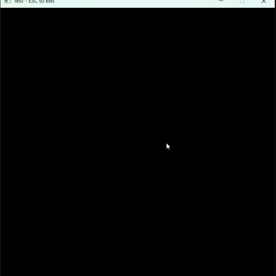
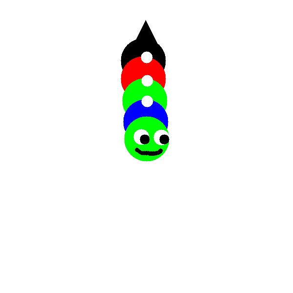
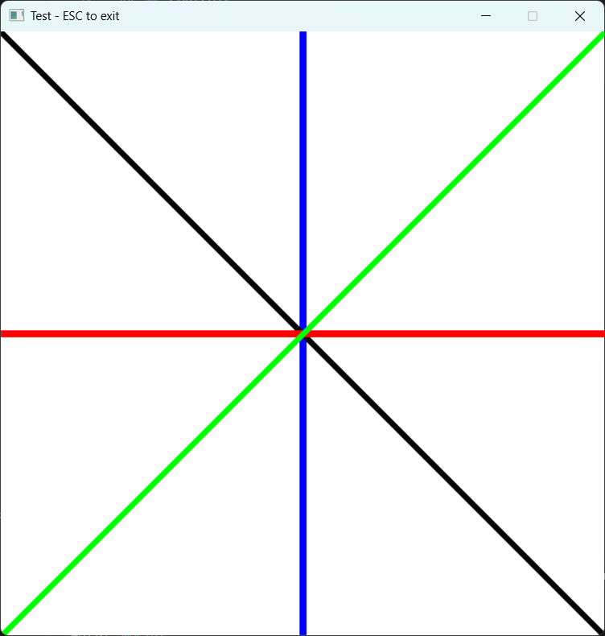
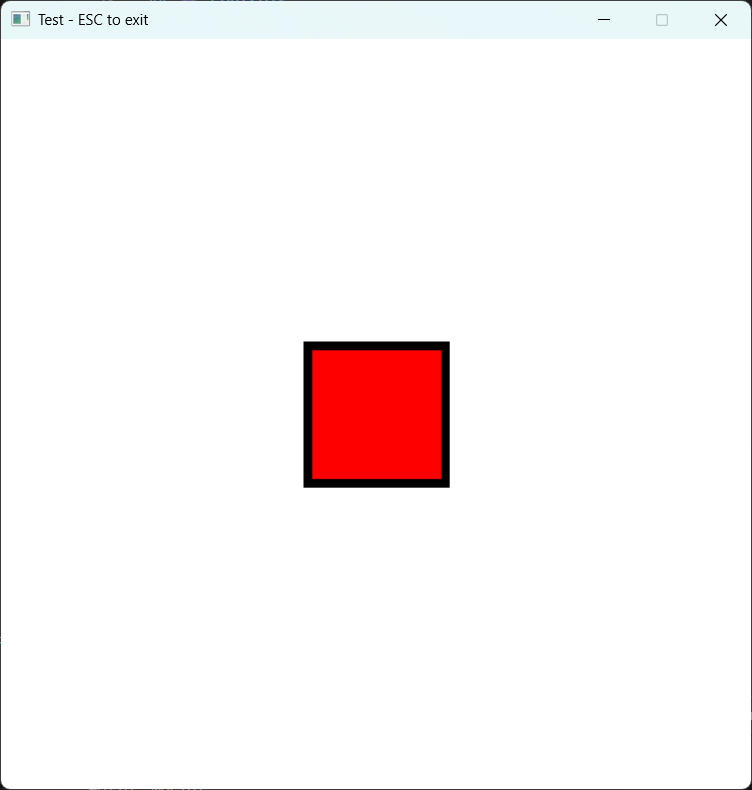
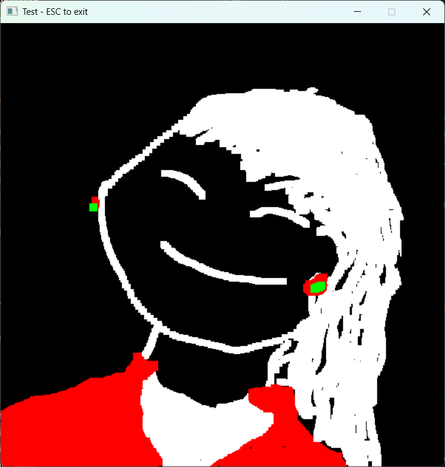
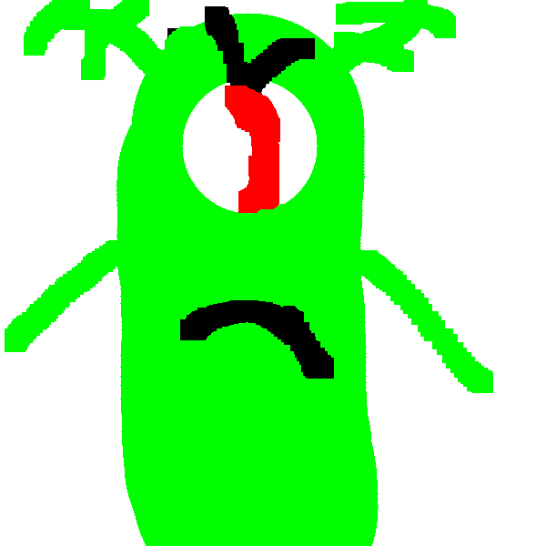

# Minimal 2D Software Renderer (Rust)

This project is a **CPU-based 2D software renderer written in Rust**.
It is designed to make every step of the rendering pipeline explicit — from input handling, to shape rasterization, to layered framebuffer composition.

The focus is not performance or GPU acceleration, but **architectural clarity** and a concrete understanding of how each pixel ends up on the screen.

It implements a custom framebuffer, explicit rendering layers, basic drawing operations, keyboard and mouse-driven interaction, and uses **minifb** purely as a lightweight window backend.

## Why this project exists

This renderer explores **software construction outside frameworks**, focusing on making
architectural decisions explicit rather than hidden behind abstractions. Feedback and discussion on architectural trade-offs are welcome.

It deliberately prioritizes:
- architectural clarity over performance
- explicit data flow over implicit state
- incremental construction over feature breadth

This is not a graphics engine, but a **learning-oriented software artifact**
designed to make trade-offs visible and discussable.

---

## ✨ Features

🚧 Work in progress

* **Explicit layered framebuffer model** (overlay vs committed content)
* Custom **RGBA framebuffer** stored entirely in CPU memory
* CPU-based rasterization of basic primitives:

  * lines
  * rectangles
  * triangles
  * circles
* Geometry-driven filling for shapes (not dependent on global flood fill)
* Brush **preview / overlay** separated from committed drawing
* Keyboard and mouse input mapped to rendering state
* Saving the current framebuffer state to an image
* `minifb` backend for window creation and pixel presentation
* Clear separation between:

  * rendering logic
  * framebuffer data
  * window and input handling

---

## 🧱 Project Structure

```
src/
├── main.rs              # Application entry point and minifb integration
└── renderer/
    ├── mod.rs           # Renderer module definition
    ├── color.rs         # RGBA color representation and constants
    ├── framebuffer.rs   # Framebuffer data structure and buffer conversion
    └── render.rs        # Renderer logic (draw operations)
```

### Module Responsibilities

* **`color.rs`**
  Simple RGBA color type with predefined constants (RED, GREEN, BLUE, ALPHA).

* **`framebuffer.rs`**
  Stores pixel data, dimensions and the main/background color of the pixels. Provides conversion to a `Vec<u32>` suitable for `minifb`, a `Vec<u8>` suitable for image export. Also provides drawing operations such as `clear`, `put_pixel` and `return_pixel`.

* **`render.rs`**
  Owns the explicit array of layers that include the main framebuffer and an preview/overlay buffer. Provides `draw_*` primitives, by using the draw operations of the framebuffers in the layer.

* **`shape.rs`**
  Stores an kind of shape definition and the color information of the shape. Provides transform operations and the rasterization operation to draw the shape in the render.
  
* **`main.rs`**
  Orchestrates the application loop, handles keyboard and mouse input, and presents the composed framebuffer using `minifb`.

---

## 🧩 Layered Rendering Model

The renderer uses **explicit framebuffer layers**:

* One or more layers for **preview / overlay drawing**
* One layer for **committed framebuffer content**

This separation allows:

* clean distinction between previewed strokes and finalized pixels
* deterministic rendering behavior
* no reliance on hidden state or implicit clearing

Layers are composed explicitly during the render pass.

---

## 🎮 Controls

| Key          | Action                                               |
| ------------ | ---------------------------------------------------- |
| NumPad 0     | White screen                                         |
| NumPad 1     | Black screen                                         |
| NumPad 2     | Blue screen                                          |
| NumPad 3     | Green screen                                         |
| NumPad 4     | Red screen                                           |
| NumPad Plus  | Increase thickness                                   |
| NumPad Minus | Decrease thickness                                   |
| LeftShift    | Changes the dynamic brush draw type                  |
| RightShift   | Changes the draw brush                               |
| S            | Draw a square                                        |
| T            | Draw a triangle                                      |
| C            | Draw a circle                                        |
| F            | Bucket fill at the center of the screen              |
| X*           | Enters draw shape mode*                              |
| Arrow Up     | Draw a vertical line from the top-middle             |
| Arrow Left   | Draw a horizontal line from the middle-left          |
| Arrow Down   | Draw a diagonal line from the top-right              |
| Arrow Right  | Draw a diagonal line from the top-left               |
| Mouse Left   | Draw with the selected brush (preview on overlay, commit on release) |
| NumPad Enter | Save the current buffer to `assets/output`           |
| ESC          | Exit the program                                     |

---

*Draw shape mode controls

| Arrow keys and M | Moves the shape on the canvas |
| Arrow keys and S | Changes the scale of the shape|
| Arrow Right or Arrow Left | Rotates the shape on either the right side or the left side |

---

## ▶️ Running the Project

```bash
cargo run
```

Make sure you have Rust installed and a platform supported by `minifb`.

---

## 🧠 Design Notes

* The scope of this project is deliberately constrained to prioritize **architectural clarity** and **explicit data flow** over feature completeness or performance optimizations.
* Rendering logic is **backend-agnostic**.
* `minifb` is used only for prototyping and visualization.
* All drawing happens on the CPU via the framebuffer.
* Algorithms are introduced only when they become architecturally necessary.
* The architecture is intentionally simple to make the rendering pipeline transparent.
* Thickness is implemented as a rasterization-time pixel offset applied to shape outlines, not as a geometric transform. This is a visual-only parameter and may cause distortions at higher values.

```
Input → Render State → Shapes → Rasterization → Layers → Framebuffer → Window
```

---

## 🚧 Current Limitations

* No user-defined custom primitives
* CPU-only rendering by design
* Trade-offs favor simplicity and readability over raw performance

These limitations are intentional at this stage.

---

## 🛣️ Possible Next Steps (not commitments)

* Optional exploration of a GPU backend (`wgpu`) without changing the core architecture

---

## 📌 Motivation

This project was built as a **learning exercise** for:

* applying Rust ownership, borrowing, and lifetimes in a renderer-style codebase
* understanding low-level rendering concepts
* practicing modular design and explicit architectural trade-offs and software building

---

## 📜 License

This project is provided for educational purposes. Use it freely to learn and experiment.

---

## 📼 Demo




---

## 🖼️ Screenshots





