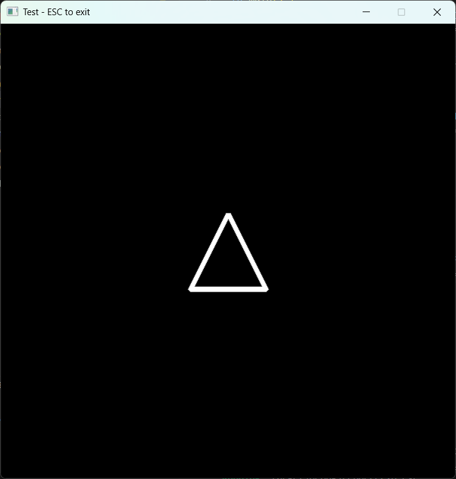
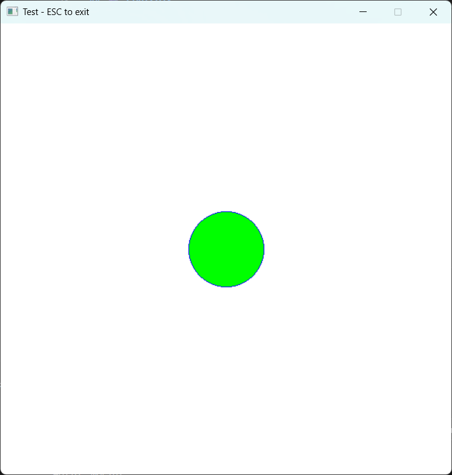

# Minimal 2D Software Renderer (Rust)

This project is a **minimal 2D software renderer written in Rust**, built for learning and experimentation with computer graphics fundamentals.

It implements a custom framebuffer, basic drawing operations, keyboard-driven interaction, and uses **minifb** as a lightweight window backend.


---

## ✨ Features

* Custom **RGBA framebuffer** stored in CPU memory
* Minimal `Render` layer responsible for drawing operations
* Basic drawing primitives: **screen fill, bucket fill, lines in eight directions, triangle, circle, rectangle**
* Keyboard input mapped to rendering state (color changes)
* `minifb` backend for window creation and presenting pixels
* Clean separation between:

  * rendering logic
  * framebuffer data
  * window/input handling

---

## 🧱 Project Structure

```
src/
├── main.rs              # Application entry point and minifb integration
└── renderer/
    ├── mod.rs           # Renderer module definition
    ├── color.rs         # RGBA color representation and constants
    ├── framebuffer.rs   # Framebuffer data structure and buffer conversion
    └── render.rs        # Renderer logic (draw operations)
```

### Module Responsibilities

* **`Color`**
  Simple RGBA color type with predefined constants (RED, GREEN, BLUE, etc.).

* **`Framebuffer`**
  Stores pixel data and dimensions. Provides conversion to a `Vec<u32>` suitable for `minifb`.

* **`Render`**
  Owns a framebuffer and provides drawing operations such as `clear` and `put_pixel`.

* **`main.rs`**
  Orchestrates the application loop, handles keyboard input, and presents the framebuffer using `minifb`.

---

## 🎮 Controls

The numeric keypad controls the screen color:

| Key      | Action       |
| -------- | ------------ |
| NumPad 0 | White screen |
| NumPad 1 | Black screen |
| NumPad 2 | Blue screen  |
| NumPad 3 | Green screen |
| NumPad 4 | Red screen   |
| NumPad Plus | Increases the thickness   |
| NumPad Minus | Decreases the thickness   |
| S        | Draw a square|
| T        | Draw a triangle|
| C        | Draw a Circle |
| F        | Bucket-Fill in the center of the screen|
| Arrow Up | Draw an Vertical Line from the middle top |
| Arrow Left | Draw an Horizontal Line middle-left |
| Arrow Down | Draw an Diagonal line from the right-top |
| Arrow Right | Draw an Diagonal Line from the left-top |
| Mouse Left |  Acts like an square brush in the canvas, drag the mouse in the window to draw multiple squares |
| ESC      | Exit program |

---

## ▶️ Running the Project

```bash
cargo run
```

Make sure you have Rust installed and a platform supported by `minifb`.

---

## 🧠 Design Notes
* The scope of this project is deliberately constrained to prioritize architectural clarity
and explicit data flow over feature completeness or performance optimizations.
* Rendering logic is **backend-agnostic**.
* `minifb` is used only for prototyping and visualization.
* All drawing happens on the CPU via the framebuffer.
* The project will implement certain algorithms as the nescessity is needed.
* The architecture is intentionally simple to make the data flow explicit:

```
Input → Render → Framebuffer → Window
```

---

## 🚧 Current Limitations

* No coordinate transforms
* No custom user primitives or draws guided by the user
* CPU-only rendering, as it is used intentionally to keep the pipeline explicit
* Trade-offs favor simplicity and readability over raw performance


These limitations are intentional at this stage.

---

## 🛣️ Possible Next Steps

* Add simple coordinate transforms (translation, scaling)
* Mouse input handling
* Explore a GPU-based backend using `winit` + `wgpu`

---

## 📌 Motivation

This project was built as a **learning exercise** for:
* applying Rust ownership, borrowing, and lifetimes in a renderer-style codebase
* understanding low-level rendering concepts
* practicing modular design and architectural trade-offs

---

## 📜 License

This project is provided for educational purposes. Use it freely to learn and experiment.

## SCREENSHOTS
 
 
 
 
